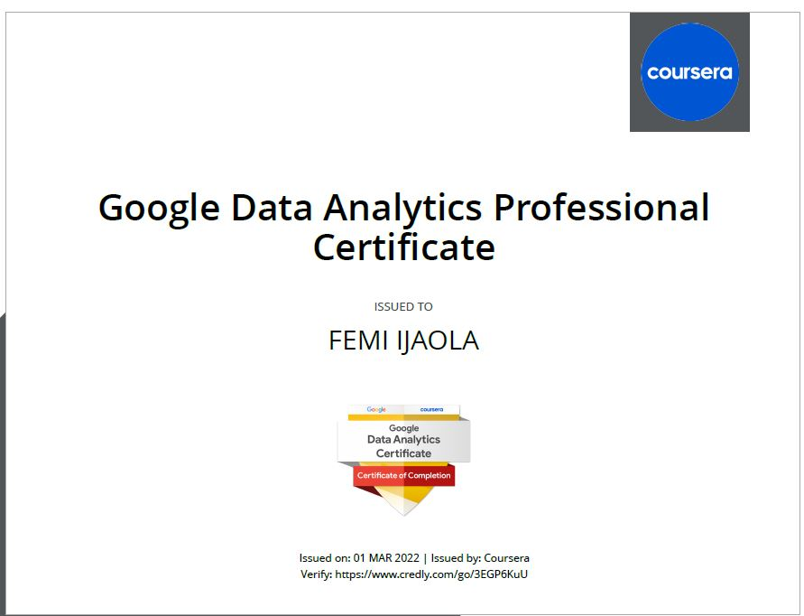

# Analyzing Marketing Campaigns with pandas

The data analysis is documented in [Analyzing_Marketing_Campaigns_with_pandas.ipynb](https://github.com/FemiTheAnalyst/Data-Projects/blob/2818c3f51a4b772dfaaaf1836d0106bc3d32e06a/Market%20Campaigns%20with%20pandas/Market%20Campaigns%20with%20pandas.ipynb). The lecture notes and the raw data files are also stored in the repository. The summary of the content is shown below:

- Pandas

- Exploratory Analysis & Summary Statistics

- Conversion Attribution

- Personalization A/B Test

# Super Store Sales Analysis
The data analysis is documented in [Analyzing_Sales_For_SuperStores.ipynb]

This analyses sales data of Super Store mart and identify opportunities to boost business growth
Super Store is a small retail business located in the United States. They sell Furniture, Office Supplies and Technology products and their customers are the mass Consumer, Corporate and Home Offices.

The data set contains sales, profit and geographical information of Super Store.

Our task is to analyse the sales data and identify weak areas and opportunities for Super Store to boost business growth.

- Which Category is Best Selling and Most Profitable?
- What are the Best Selling and Most Profitable Sub-Category?
- Which is the Top Selling Sub-Category?
- Which Customer Segment is Most Profitable?
- Which is the Preferred Ship Mode?
- Which Region is the Most Profitable?
- Which City has the Highest Number of Sales?

# Data-Projects
cohort analysis on customer retention

## Certificate of Completion

